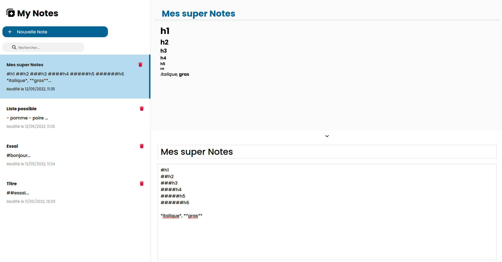

<h1 align="center">
   
  
   
MyNotePad 
</h1>
<h4 align="center">MyNotePad est une application de prise de note avec la possibilité d'écrire directement en markdown développé sous ReactJS et utilise le localStorage pour la conservation des notes.</h4>
 

## WEB version 🌐

Le site est en live ici 👉 [NotePad](https://guillaume-rygn.github.io/MyNotePad/)

## Technologies utilisées ⚙️

Pour ce programme les technologies suivantes ont été utilisé :  

 
 
Bonne découverte !

## Crédit 🔗
[Guillaume Reygner](https://github.com/guillaume-rygn)